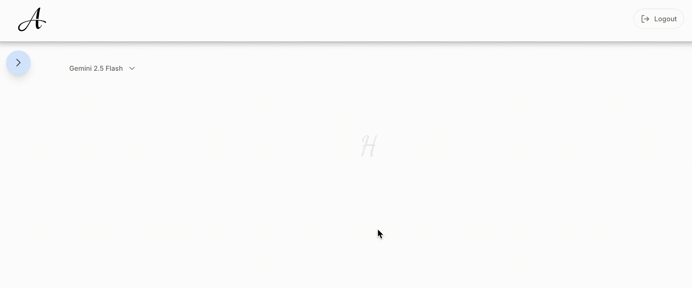
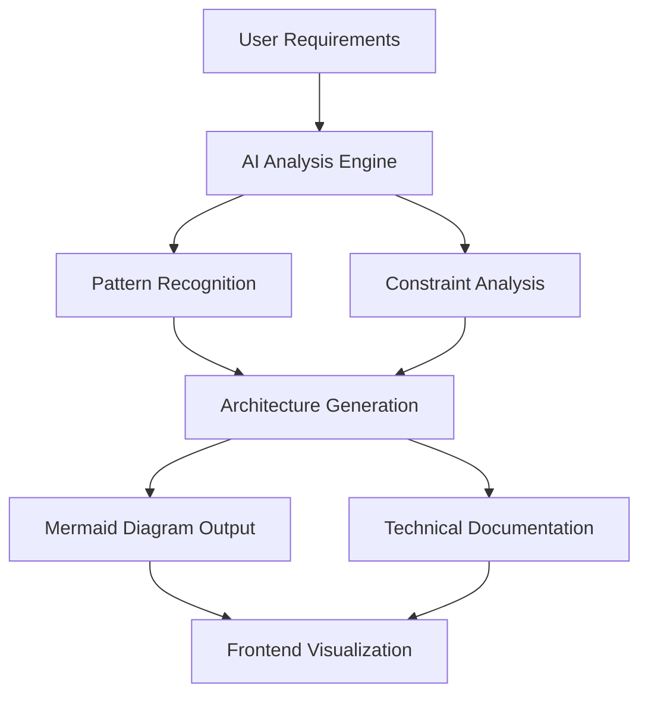
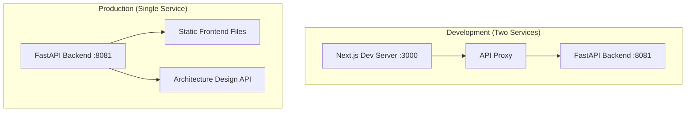
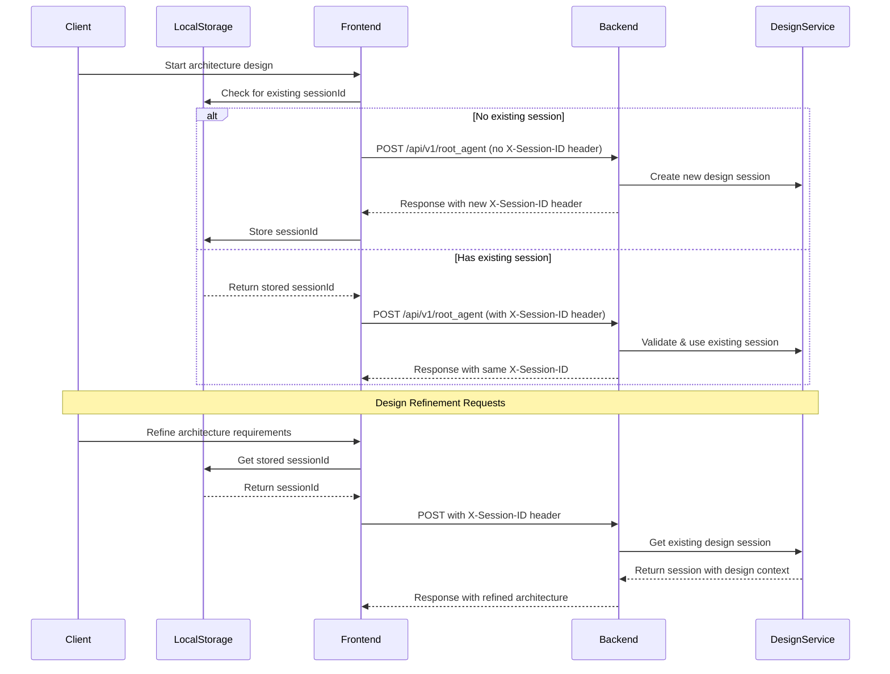

<div align="center">
  
  <p>Flowgen - AI-Powered System Architecture Solutions</p>

  <br>

  


[](https://opensource.org/licenses/Apache-2.0)


**Owner / Maintainer:** [Loïc Muhirwa](https://github.com/justmeloic)

</div>
An intelligent agent that helps you draft end-to-end solutions solutions architectures. The agent interacts with users to gather requirements, understand technical constraints, and generates comprehensive Mermaid architecture diagrams with detailed explanations.

## ✨ Key Features

- 🎯 **Interactive Requirements Gathering**: AI-powered questioning to understand your system needs
- 🏗️ **Architecture Pattern Recognition**: Automatic identification of suitable architectural patterns
- 📊 **Mermaid Diagram Generation**: Beautiful, interactive architecture diagrams
- 🔍 **Constraint Analysis**: Technical, budgetary, and operational constraint evaluation
- 📚 **Implementation Guidance**: Step-by-step development recommendations
- 🔄 **Real-time Refinement**: Iterative design improvement through conversation

## 🎯 Use Cases

- **Microservices Architecture**: Design scalable, distributed systems
- **Serverless Solutions**: Cloud-native, event-driven architectures
- **Data Pipeline Design**: ETL/ELT processes and data flow architectures
- **API Gateway Patterns**: Service mesh and API management solutions
- **Security Architecture**: Zero-trust and defense-in-depth designs
- **Cloud Migration**: Hybrid and multi-cloud architecture planning

## Services

Each service has its own README with specific setup instructions. Please refer to:

- [Frontend Setup](services/frontend/README.md)
- [Architecture Agent API Setup](services/backend/README.md)

### Frontend Client (services/frontend)

A Next.js web application that provides an interactive interface for working with the Architecture Solution Designer. Features include:

- Interactive chat interface for requirement gathering
- Real-time Mermaid diagram rendering and visualization
- Architecture pattern recommendations and best practices
- Technical constraint analysis and solution optimization

### Architecture Agent API (services/backend)

The backend service that orchestrates the AI agent for architecture design:

- Requirements analysis and constraint identification
- Architecture pattern matching and recommendations
- Mermaid diagram generation for complex system architectures
- Technical documentation and implementation guidance
- Solution validation and optimization suggestions

## Repository Structure

```
.
├── docs
├── scripts
│   └── deploy.sh
└── services
    ├── backend
    │   ├── pyproject.toml
    │   ├── src
    │   ├── static_frontend
    │   ├── tests
    │   └── uv.lock
    └── frontend
        ├── components.json
        ├── next-env.d.ts
        ├── next.config.mjs
        ├── package-lock.json
        ├── package.json
        ├── postcss.config.mjs
        ├── public
        ├── src
        ├── tailwind.config.js
        └── tsconfig.json
```

## Architecture


The Architecture Solution Designer leverages AI to understand user requirements and generate comprehensive system diagrams:



## Deployment Models

This project supports flexible development and deployment patterns:

### Development Mode (Two Services)

During development, you can run the frontend and backend as separate services over the network for faster iteration and hot-reloading:

**Frontend Development Server:**

```bash
cd services/frontend/
make dev  # Runs on http://localhost:3000
```

**Backend API Server:**

```bash
cd services/backend/
make dev  # Runs on http://localhost:8081
```

The frontend development server will proxy API calls to the backend service, allowing you to develop with full hot-reload capabilities.

### Production Deployment (Single Service)

For production deployment, the system uses a **unified deployment model** where:

1. **Static Build**: The Next.js frontend is pre-rendered into static HTML, CSS, and JavaScript files
2. **Single Service**: The FastAPI backend serves both API endpoints and the static frontend files
3. **Simplified Deployment**: Only one service to deploy, manage, and monitor

**Production Build & Deploy:**

```bash
# Build static frontend and deploy
make build
```

### Why This Architecture?

**Benefits:**

- **Resource Efficiency**: Single service reduces memory and CPU overhead
- **Simplified Networking**: No need to manage cross-service communication
- **Easier Monitoring**: One process to monitor instead of two
- **Port Management**: Only one port to expose and manage

**Development vs Production:**

- **Development**: Two services for faster iteration and debugging
- **Production**: Single service for optimal performance and simplicity

**Architecture Comparison:**



## Session Management & Design Continuity

The Architecture Designer maintains design continuity throughout your architecture discovery process. The following diagram illustrates how design sessions are managed between the frontend and backend:



The design session management flow works as follows:

1. **Initial Design Session**:

   - If no session exists, the frontend makes a request without a session ID
   - The backend generates a new UUID and creates a new design session
   - The session ID is returned in the X-Session-ID header
   - The frontend stores this ID in localStorage

2. **Design Iteration Requests**:

   - The frontend retrieves the session ID from localStorage
   - All requests include the X-Session-ID header with design context
   - The backend validates and uses the existing session
   - The same session ID is returned in responses

3. **Design State Management**:
   - The backend maintains design state using ADK's InMemorySessionService
   - Each session tracks requirements, constraints, and architectural decisions
   - Design context persists across multiple refinement iterations
   - Sessions maintain conversation history for context-aware improvements

This stateful approach ensures design continuity and context preservation across multiple interactions, allowing for iterative architecture refinement.

## File Upload for Architecture Context

The Architecture Designer supports file uploads to provide additional context for your system design. Files are processed immediately and their content is made available to the AI agent to inform architecture decisions.

### Supported File Types

- **Architecture Documents**: PDF, Markdown, Plain text
- **Existing Diagrams**: PNG, JPEG, GIF, WebP (for reference)
- **Requirements**: JSON, CSV (structured requirements)
- **Code Samples**: Python, JavaScript, Java, etc. (for understanding existing systems)
- **Configuration Files**: YAML, JSON, XML (infrastructure configs)

### How It Works

1. **Unified Processing**: Files and requirements are sent together to `/api/v1/root_agent/`
2. **Context Integration**: Files are validated, stored as artifacts, and processed upon upload
3. **Architecture Awareness**: File content is analyzed and integrated into the design process
4. **Memory Storage**: Uses ADK's `InMemoryArtifactService` for efficient temporary storage

### Usage in Architecture Design

1. Click the attachment button (📎) in the chat input
2. Select relevant files (up to 10MB each, 5 files max)
3. Describe your architecture requirements
4. The agent receives both your requirements and file content as context

### Example Enhanced Architecture Process

When you upload a requirements document with the message "Design a microservices architecture for this system", the agent receives:

```
User: "Design a microservices architecture for this system"

[Files uploaded with this message:]
File: system-requirements.pdf
Document analysis:
- Functional Requirements: User management, payment processing, inventory
- Non-functional: 1M+ users, 99.9% uptime, PCI compliance
- Constraints: 6-month timeline, AWS only, existing PostgreSQL
```

### Technical Implementation

- **Backend**: File validation, artifact storage, architecture-aware content processing
- **Frontend**: File attachment component with drag & drop (planned)
- **Storage**: In-memory artifacts (temporary, cleared on restart)
- **Processing**: Architecture-focused processors for optimal design context extraction

### Security

- MIME type validation with magic byte verification
- File size limits (10MB default)
- Basic malicious content detection
- Sandboxed file processing for architecture documents

## Building and Deploying

This project uses a **streamlined deployment model** where the frontend is pre-rendered into static files and served by the FastAPI backend as a single deployable unit.

### Deployment Strategy

The deployment process provides:

1. **Static Frontend Build**: Next.js frontend is pre-rendered into static HTML, CSS, and JavaScript files
2. **Single Service Deployment**: FastAPI backend serves both API endpoints and static frontend files
3. **Local Deployment**: Optimized for local hosting without external dependencies

### Build Process

#### Automated Build

Use the build script to prepare the frontend for deployment:

```bash
# From project root
make build
```

This script:

1. 🎨 **Frontend Build**: Installs dependencies and runs `npm run build-static`
2. � **Static Copy**: Copies static files to `services/backend/build/static_frontend/`
3. ✅ **Validation**: Ensures build completed successfully

#### Manual Frontend Build

Build the frontend manually if needed:

```bash
cd services/frontend
make build          # Build and copy to backend
```

### Deployment Process

#### Automated Deployment

Deploy the application:

```bash
# From project root
source scripts/deploy.sh
```

This script:

1. 🛠️ **Environment Setup**: Creates Python virtual environment and installs dependencies
2. 🧹 **Cleanup**: Clears Python cache and kills existing server processes
3. 🛑 **Port Management**: Ensures port 8081 is available for the server
4. 📺 **Server Start**: Starts Uvicorn server in a detached screen session
5. 📊 **Summary**: Provides deployment summary and management commands

#### Deployment Architecture


#### Why This Approach?

**Single Service Benefits**:

- **Resource Efficiency**: Minimal memory and CPU usage
- **Simplified Management**: One process to monitor and manage
- **Network Simplicity**: Only one port (8081) to expose
- **Fast Startup**: Quick boot times

**Static Frontend Benefits**:

- **Performance**: Pre-rendered content loads faster
- **Lower Resource Usage**: No Node.js runtime required in production
- **Reliability**: Fewer moving parts reduce potential failure points

### Server Management

After deployment, manage the server using screen:

```bash
# Attach to the running server (see logs in real-time)
screen -r backend

# Detach from screen session (server keeps running)
# Press: Ctrl+A, then D

# List all screen sessions
screen -list

# Stop the server
screen -S backend -X quit
```

### Environment Configuration

The deployment uses optimized settings:

- **Server Host**: `0.0.0.0` (accessible from network)
- **Server Port**: `8081` (avoids conflicts with common services)
- **Python Environment**: Virtual environment in `services/backend/.venv`
- **Static Files**: Served from `services/backend/build/static_frontend/`

### Performance Notes

- **Memory Usage**: Typically uses 150-300MB RAM (depending on model complexity and diagram generation)
- **CPU Usage**: Low CPU usage during idle, moderate during AI processing and diagram generation
- **Storage**: Requires ~500MB for application and dependencies
- **Network**: Accessible via server's IP address on port 8081
- **Architecture Generation**: Real-time Mermaid diagram generation with sub-second response times

## License

This project is licensed under the Apache License, Version 2.0 - see the [LICENSE](LICENSE) file for details.
