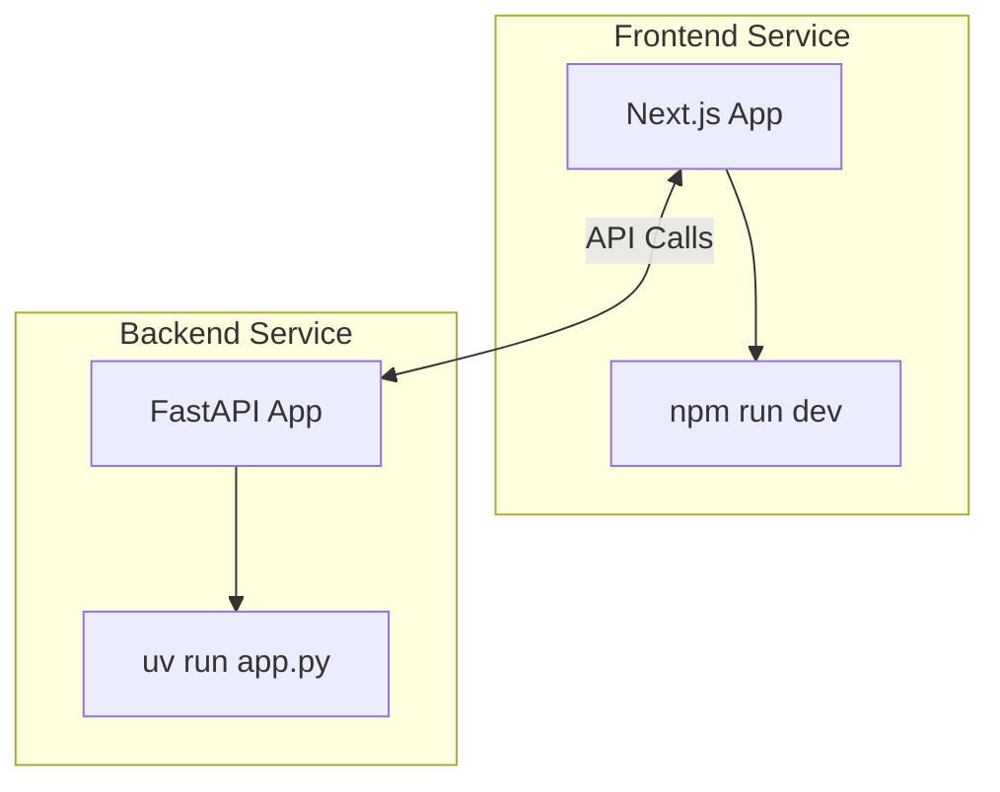
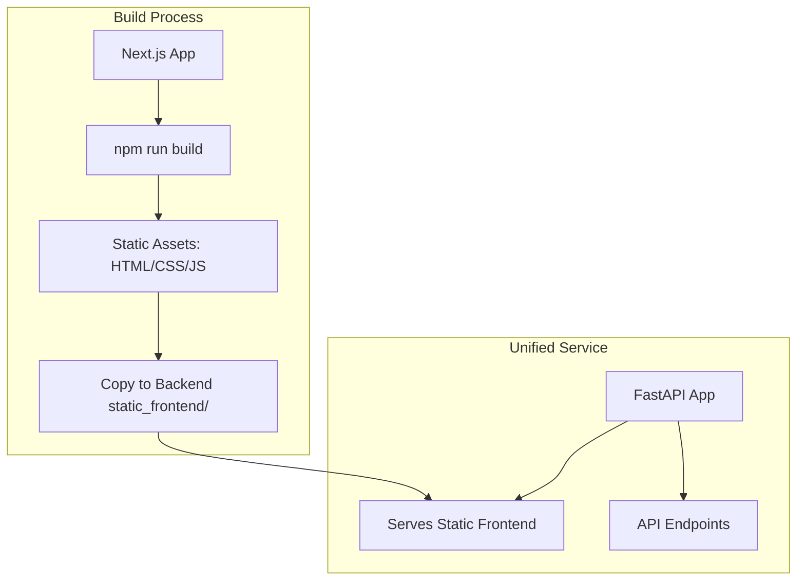
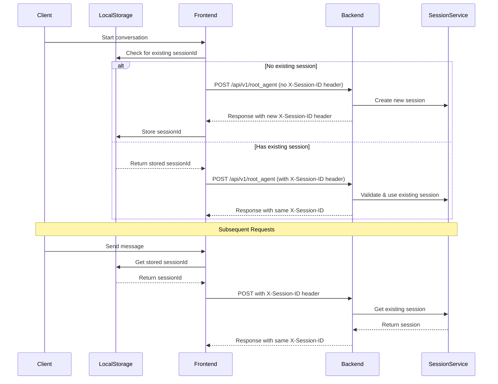
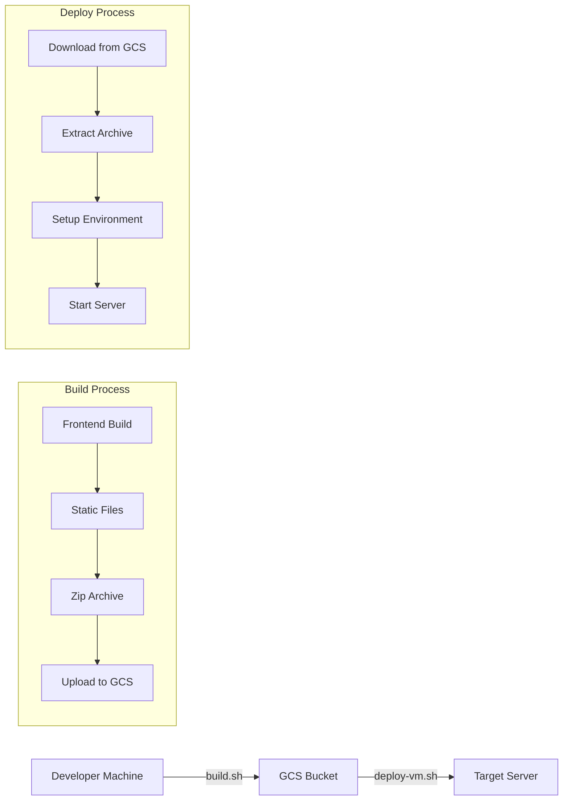

<div align="center">
  

  <br>
</div>

---

# Collective Bargaining Agreement & Grievance Agent


[](https://opensource.org/licenses/Apache-2.0)

**Author / Maintainer:** [Loïc Muhirwa](https://github.com/justmeloic)

An agentic question answering system powered by AI for CBA analysis,
built with Google Cloud Platform services.

## Services

Each service has its own README with specific setup instructions. Please refer to:

- [Frontend Setup](services/frontend/README.md)
- [Agent Orchestration Setup](services/agent-orchestration/README.md)

### Frontend Client (services/front-end)

A Next.js web application that provides the user interface for interacting with the CBA analysis system.

### Agent Orchestration API (services/agent-orchestration)

The backend service that coordinates AI agents for:

- Understanding user queries
- CBA analysis
- Response generation

## Repository Structure

```
.
├── docs
├── scripts
│   └── deploy.sh
└── services
    ├── agent-orchestration
    │   ├── pyproject.toml
    │   ├── src
    │   ├── static_frontend
    │   ├── tests
    │   └── uv.lock
    └── frontend
        ├── components.json
        ├── next-env.d.ts
        ├── next.config.mjs
        ├── package-lock.json
        ├── package.json
        ├── postcss.config.mjs
        ├── public
        ├── src
        ├── tailwind.config.js
        └── tsconfig.json
```

## Architecture


## Component Usage

| Component                   | Type             | Description                                                                                 |
| --------------------------- | ---------------- | ------------------------------------------------------------------------------------------- |
| Vertext AI Search           | GCP              | Semantic search for RAG                                                                     |
| GCS Bucket                  | GCP              | Storage for raw CBA files, temporary processing data, and backup storage                    |
| Cloud Logging               | GCP              | Monitors application performance and tracks data processing operations                      |
| Cloud Run                   | GCP              | Hosts containerized services for web interfaces and APIs                                    |
| ADK (Agent Development Kit) | Development Tool | Provides development tools and libraries for building and testing the agentic orchestration |

## Deployment Models

This project is structured to support two primary deployment models, offering flexibility based on your operational needs, team structure, and scaling requirements. The choice of model can impact local development, testing, and production rollout.

### 1. Independent Services (Microservice-Style)

In this model, the Next.JS frontend and the FastAPI backend are deployed and managed as separate, independent services.

### _Dev_

```bash
cd services/frontend/
npm run dev
```

```bash
cd services/agent-orchestration/src/
uv run app.py
```

**Architecture:**



### 2. Modular Monolith (Combined Deployment)

In this model, the FastAPI backend serves the static assets generated from the Next.JS frontend, creating a single deployable unit. This is the model facilitated by the npm run build script in the frontend service, which prepares assets for the backend.

### _Dev_

```bash
cd services/frontend/
npm run build-local # This builds the static (pre-rendered into HTML, CSS, and JavaScript files) frontend into "out" and copies it over to the backend agent-orchestration/build/static_frontend

cd ../agent-orchestration/src/
uv run app.py # Services backend with agent-orchestration/build/static_frontend mounted
```

**Architecture:**



## Session Management

The following diagram illustrates how session IDs are managed between the frontend and backend:



The session management flow works as follows:

1. **Initial Request**:

   - If no session exists, the frontend makes a request without a session ID
   - The backend generates a new UUID and creates a new session
   - The session ID is returned in the X-Session-ID header
   - The frontend stores this ID in localStorage

2. **Subsequent Requests**:

   - The frontend retrieves the session ID from localStorage
   - All requests include the X-Session-ID header
   - The backend validates and uses the existing session
   - The same session ID is returned in responses

3. **Session State**:
   - The backend maintains session state using ADK's InMemorySessionService
   - Each session tracks conversation history and user context
   - Sessions persist as long as the backend service is running

This stateful approach ensures conversation continuity and context preservation across multiple interactions.

## Authentication

This application uses a simple header-based authentication system. It provides basic access control using a secret code that is validated on the server.

### How it Works

1.  **Login Page**: Users are redirected to `/login` when they try to access any protected page.
2.  **Secret Code**: Users must enter the correct access code to gain access.
3.  **Authentication Endpoint**: The frontend sends the secret to the `/api/v1/auth/login` endpoint on the backend.
4.  **Session Management**: If the secret is correct, the backend creates an authenticated session and returns a session ID to the frontend.
5.  **Session ID**: The frontend stores the session ID in local storage and includes it in the `X-Session-ID` header of all subsequent requests.
6.  **Middleware**: A middleware on the backend validates the session ID on all protected routes.
7.  **Logout**: When a user logs out, the frontend calls the `/api/v1/auth/logout` endpoint to invalidate the session on the server.

### Configuration

The authentication is configured in the backend's `.env` file:

```bash
# Authentication
AUTH_SECRET=your-super-secret-key
```

### Components

- **Login Page**: `services/frontend/src/app/login/page.tsx` - The login form.
- **Authentication API**: `services/agent-orchestration/src/app/api/v1/auth.py` - The login and logout endpoints.
- **Session Middleware**: `services/agent-orchestration/src/app/middleware/session_middleware.py` - The middleware that protects routes.
- **useAuth Hook**: `services/frontend/src/hooks/useAuth.ts` - The frontend logic for handling authentication state.
- **ProtectedRoute**: `services/frontend/src/components/protected-route.tsx` - The component that wraps protected pages.

### Security Notes

This is a simple authentication system suitable for a proof-of-concept. For production use, consider implementing more robust security measures such as:

- JWT tokens
- Database user management
- Password hashing
- Rate limiting
- HTTPS enforcement
- Security headers

## Building and Deploying

This project uses a streamlined deployment model where the frontend is pre-rendered into static files and served by the FastAPI backend as a single deployable unit. The build is packaged and transferred via Google Cloud Storage for deployment on air-gapped environments.

### Deployment Strategy Overview

The deployment process follows these key principles:

1. **Static Frontend Build**: The Next.js frontend is pre-rendered into static HTML, CSS, and JavaScript files
2. **Single Service Deployment**: The FastAPI backend serves both API endpoints and static frontend files
3. **Air-Gapped Deployment**: Build artifacts are transferred via GCS bucket since deployment servers may not have internet access to clone repositories

### Build Process

#### Automated Build & Upload

Use the automated build script to build the frontend and upload to GCS:

```bash
# From project root
source scripts/build.sh
```

This script performs the following steps:

1. 🎨 **Frontend Build**: Runs `npm install` (if needed) and `npm run build-static` in the frontend service
2. 📦 **Archive Creation**: Creates a timestamped zip archive of the agent-orchestration service (including static frontend)
3. 🧹 **GCS Cleanup**: Removes any existing build archives from the GCS bucket
4. ☁️ **Upload**: Uploads the new build archive to `gs://cn-cba-usecase/`
5. 🗑️ **Local Cleanup**: Removes the local zip file after upload

#### Manual Frontend Build

If you need to build just the frontend manually:

```bash
cd services/frontend
npm install                    # Install dependencies if needed
npm run build-static          # Build and copy to backend
```

The `build-static` script performs:

```bash
rm -rf .next out && next build && rm -rf ../agent-orchestration/build/static_frontend && cp -R ./out ../agent-orchestration/build/static_frontend
```

### Deployment Process

#### Automated Deployment

Deploy the latest build from GCS to your server:

```bash
# From project root (on target server)
source scripts/deploy-vm.sh
```

This script performs the following steps:

1. 📁 **Setup**: Creates deployment directory at `$PROJECT_ROOT/test_serving`
2. 🔍 **Discovery**: Finds the latest build archive in the GCS bucket
3. ⬇️ **Download**: Downloads and extracts the build archive
4. 🐍 **Environment**: Sets up Python virtual environment and installs dependencies
5. 🛑 **Cleanup**: Kills any existing processes using port 8000 or running uvicorn
6. 📺 **Server**: Starts the FastAPI server in a detached screen session
7. 📊 **Summary**: Provides deployment summary and screen session commands

#### Deployment Architecture



#### Why This Approach?

**Single Service Deployment**:

- Simplifies deployment by having one FastAPI service that handles both API and frontend
- Reduces operational complexity compared to managing separate frontend/backend services
- Better performance due to reduced network hops

**GCS-Based Transfer**:

- Target deployment servers often lack internet access for security reasons
- GCS provides reliable, versioned artifact storage
- Enables deployment to air-gapped environments
- Supports rollback by keeping previous build archives

**Static Frontend Benefits**:

- Faster page loads with pre-rendered content
- Better SEO with server-side rendering at build time
- Reduced server load as static files are served directly
- Simplified deployment with no Node.js runtime required on the server

### Server Management

After deployment, use these commands to manage the server:

```bash
# Attach to the running server (see logs in real-time)
screen -r agent-orchestration

# Detach from screen session (server keeps running)
# Press: Ctrl+A, then D

# List all screen sessions
screen -list

# Kill the server session
screen -S agent-orchestration -X quit
```

### Environment Configuration

The deployment uses these key directories:

- **Deploy Directory**: `$PROJECT_ROOT/test_serving` - Where builds are extracted and run
- **Log Directory**: `$PROJECT_ROOT/logs` - Build and deployment logs
- **Static Frontend**: `build/static_frontend/` - Pre-rendered frontend files served by FastAPI

### Build Artifacts

- **Build Archive**: `build-YYYYMMDD_HHMMSS.zip` in GCS bucket
- **Log Files**: `build_YYYYMMDD_HHMMSS.log` and `deploy_YYYYMMDD_HHMMSS.log`
- **Server URL**: `http://0.0.0.0:8000` (accessible on deployment server)

The build output will be in the `out/` directory and needs to be copied to the backend's static folder for deployment.

## License

This project is licensed under the Apache License, Version 2.0 - see the [LICENSE](LICENSE) file for details.
