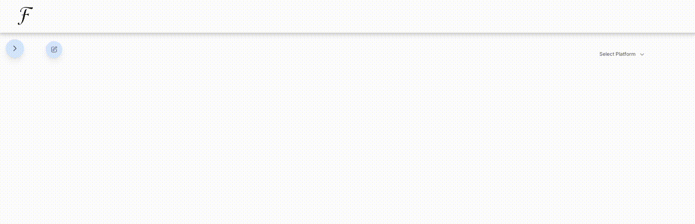

<div align="center">
  
  <p>Flowgen - AI-Powered System Architecture Solutions</p>

  <br>

  


[](https://opensource.org/licenses/Apache-2.0)


**Owner / Maintainer:** [Loïc Muhirwa](https://github.com/justmeloic)

</div>
An intelligent agent that helps you draft end-to-end solutions solutions architectures. The agent interacts with users to gather requirements, understand technical constraints, and generates comprehensive Mermaid architecture diagrams with detailed explanations.

## Key Features

- **Interactive Requirements Gathering**: AI-powered questioning to understand your system needs
- **Architecture Pattern Recognition**: Automatic identification of suitable architectural patterns
- **Mermaid Diagram Generation**: Beautiful, interactive architecture diagrams
- **Constraint Analysis**: Technical, budgetary, and operational constraint evaluation
- **Implementation Guidance**: Step-by-step development recommendations
- **Real-time Refinement**: Iterative design improvement through conversation

### Interactive Diagram Generation

<div align="center">
  
  <p><em>Real-time Mermaid diagram generation with interactive panel</em></p>
</div>

## Use Cases

- **Microservices Architecture**: Design scalable, distributed systems
- **Serverless Solutions**: Cloud-native, event-driven architectures
- **Data Pipeline Design**: ETL/ELT processes and data flow architectures
- **API Gateway Patterns**: Service mesh and API management solutions
- **Security Architecture**: Zero-trust and defense-in-depth designs
- **Cloud Migration**: Hybrid and multi-cloud architecture planning

## Services

Each service has its own README with specific setup instructions. Please refer to:

- [Frontend Setup](services/frontend/README.md)
- [Backend API Setup](services/backend/README.md)

### Frontend Client (services/frontend)

A Next.js web application that provides an interactive interface for working with the Architecture Solution Designer. Features include:

- Interactive chat interface for requirement gathering
- Real-time Mermaid diagram rendering and visualization
- Architecture pattern recommendations and best practices
- Technical constraint analysis and solution optimization

### Backend API (services/backend)

The backend service that orchestrates the AI agent for architecture design:

- Requirements analysis and constraint identification
- Architecture pattern matching and recommendations
- Mermaid diagram generation for complex system architectures
- Technical documentation and implementation guidance
- Solution validation and optimization suggestions
- Static frontend hosting for unified deployment

## Repository Structure

```
.
├── docs
└── services
    ├── backend
    │   ├── pyproject.toml
    │   ├── src
    │   ├── build/
    │   │   └── static_frontend/    # Built frontend files
    │   ├── tests
    │   └── uv.lock
    └── frontend
        ├── components.json
        ├── next-env.d.ts
        ├── next.config.mjs
        ├── package-lock.json
        ├── package.json
        ├── postcss.config.mjs
        ├── public
        ├── src
        ├── tailwind.config.js
        └── tsconfig.json
```

## Architecture

The Architecture Solution Designer leverages AI to understand user requirements and generate comprehensive system diagrams:

```mermaid
graph TB
    %% User Interface Layer
    User[👤 User] --> UI[🖥️ Next.js Frontend]

    %% Frontend Components
    UI --> Chat[💬 Chat Interface]
    UI --> FileUpload[📎 File Upload]
    UI --> DiagramView[📊 Diagram Viewer]

    %% API Gateway
    Chat --> API[🔗 FastAPI Backend]
    FileUpload --> API

    %% Backend Services
    API --> Agent[🤖 AI Agent]
    API --> SessionMgr[🗂️ Session Manager]
    API --> FileProcessor[📄 File Processor]

    %% AI Processing Layer
    Agent --> Requirements[📋 Requirements Analysis]
    Agent --> Patterns[🏗️ Pattern Recognition]
    Agent --> Constraints[⚖️ Constraint Analysis]

    %% Generation Layer
    Requirements --> Generator[⚡ Architecture Generator]
    Patterns --> Generator
    Constraints --> Generator

    %% Output Layer
    Generator --> MermaidCode[📐 Mermaid Code]
    Generator --> Documentation[📚 Tech Documentation]
    Generator --> Recommendations[💡 Implementation Guide]

    %% File Processing
    FileProcessor --> ArtifactStore[🗃️ Artifact Storage]
    ArtifactStore --> Agent

    %% Session Management
    SessionMgr --> SessionStore[💾 Session Storage]
    SessionStore --> Agent

    %% Frontend Rendering
    MermaidCode --> DiagramView
    Documentation --> Chat
    Recommendations --> Chat

    %% Styling
    classDef userLayer fill:#e1f5fe
    classDef frontendLayer fill:#f3e5f5
    classDef backendLayer fill:#e8f5e8
    classDef aiLayer fill:#fff3e0
    classDef outputLayer fill:#fce4ec

    class User,UI,Chat,FileUpload,DiagramView userLayer
    class API,SessionMgr,FileProcessor frontendLayer
    class Agent,Requirements,Patterns,Constraints,Generator backendLayer
    class MermaidCode,Documentation,Recommendations,ArtifactStore,SessionStore aiLayer
```



## Getting Started

### Quick Start

Use the Makefile for streamlined development and deployment:

```bash
# Development mode (run both services separately)
make dev

# Build frontend static files for production
make build
```

### Development Mode (Two Services)

For development with hot-reloading:

```bash
# Start development servers for both services
make dev
```

This runs:

- Frontend development server at `http://localhost:3000`
- Backend API server at `http://localhost:8081`

### Production Mode (Single Service)

For production deployment, the frontend is built into static files and served by the backend:

```bash
# Build static frontend
make build

# The backend now serves both API and frontend at http://localhost:8081
```

## Session Management & Design Continuity

The Architecture Designer maintains design continuity throughout your architecture discovery process. The following diagram illustrates how design sessions are managed between the frontend and backend:


The design session management flow works as follows:

1. **Initial Design Session**:

   - If no session exists, the frontend makes a request without a session ID
   - The backend generates a new UUID and creates a new design session
   - The session ID is returned in the X-Session-ID header
   - The frontend stores this ID in localStorage

2. **Design Iteration Requests**:

   - The frontend retrieves the session ID from localStorage
   - All requests include the X-Session-ID header with design context
   - The backend validates and uses the existing session
   - The same session ID is returned in responses

3. **Design State Management**:
   - The backend maintains design state using ADK's InMemorySessionService
   - Each session tracks requirements, constraints, and architectural decisions
   - Design context persists across multiple refinement iterations
   - Sessions maintain conversation history for context-aware improvements

This stateful approach ensures design continuity and context preservation across multiple interactions, allowing for iterative architecture refinement.

## File Upload for Architecture Context

The Architecture Designer supports file uploads to provide additional context for your system design. Files are processed immediately and their content is made available to the AI agent to inform architecture decisions.

### Supported File Types

- **Architecture Documents**: PDF, Markdown, Plain text
- **Existing Diagrams**: PNG, JPEG, GIF, WebP (for reference)
- **Requirements**: JSON, CSV (structured requirements)
- **Code Samples**: Python, JavaScript, Java, etc. (for understanding existing systems)
- **Configuration Files**: YAML, JSON, XML (infrastructure configs)

### How It Works

1. **Unified Processing**: Files and requirements are sent together to `/api/v1/root_agent/`
2. **Context Integration**: Files are validated, stored as artifacts, and processed upon upload
3. **Architecture Awareness**: File content is analyzed and integrated into the design process
4. **Memory Storage**: Uses ADK's `InMemoryArtifactService` for efficient temporary storage

### Usage in Architecture Design

1. Click the attachment button (📎) in the chat input
2. Select relevant files (up to 10MB each, 5 files max)
3. Describe your architecture requirements
4. The agent receives both your requirements and file content as context

### Example Enhanced Architecture Process

When you upload a requirements document with the message "Design a microservices architecture for this system", the agent receives:

```
User: "Design a microservices architecture for this system"

[Files uploaded with this message:]
File: system-requirements.pdf
Document analysis:
- Functional Requirements: User management, payment processing, inventory
- Non-functional: 1M+ users, 99.9% uptime, PCI compliance
- Constraints: 6-month timeline, AWS only, existing PostgreSQL
```

### Technical Implementation

- **Backend**: File validation, artifact storage, architecture-aware content processing
- **Frontend**: File attachment component with drag & drop (planned)
- **Storage**: In-memory artifacts (temporary, cleared on restart)
- **Processing**: Architecture-focused processors for optimal design context extraction

### Security

- MIME type validation with magic byte verification
- File size limits (10MB default)
- Basic malicious content detection
- Sandboxed file processing for architecture documents

## Deployment

### Architecture Overview

The system uses a unified deployment model:

1. **Static Build**: Frontend is pre-rendered into static HTML, CSS, and JavaScript files
2. **Single Service**: FastAPI backend serves both API endpoints and static frontend files
3. **Simplified Operations**: Only one deployable unit with Python runtime requirement

### Deployment Process

```bash
# Build static frontend for production
make build

# The backend service now contains the frontend and serves everything at port 8081
```

**Final deployment requirements:**

- Python 3.13+ runtime
- Single service deployment
- Frontend assets mounted in backend at build time

### Why This Architecture?

**Benefits:**

- **Resource Efficiency**: Single service reduces memory and CPU overhead
- **Simplified Networking**: No cross-service communication needed
- **Easier Operations**: One process to deploy, monitor, and manage
- **Port Management**: Only one port to expose and configure

### Development vs Production

- **Development**: Two services (`make dev`) for faster iteration with hot-reloading
- **Production**: Single service (`make build`) for optimized deployment

## License

This project is licensed under the Apache License, Version 2.0 - see the [LICENSE](LICENSE) file for details.
