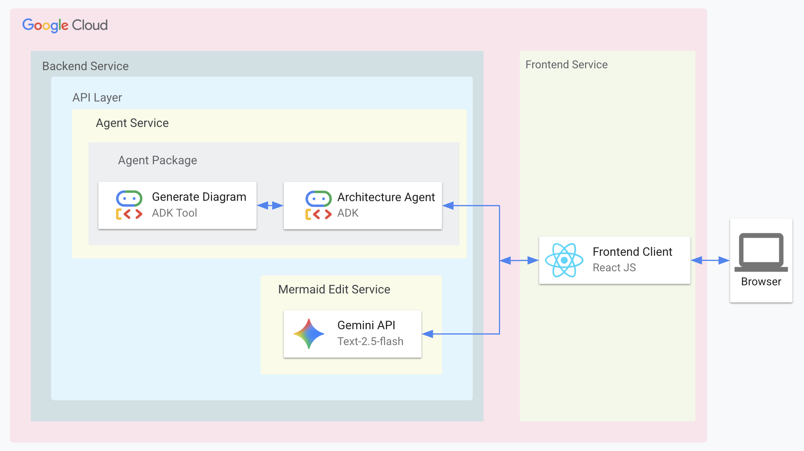

<div align="center">
  
  <p>A Multi-Model AI Agent Interface</p>

  <br>

  


[](https://opensource.org/licenses/Apache-2.0)


**Owner / Maintainer:** [Loïc Muhirwa](https://github.com/justmeloic)

</div>
An interface that allows users to interact with different AI agents powered by various models and equipped with specialized tools. **Optimized for deployment on Raspberry Pi 5** with a streamlined single-service architecture.

## Services

Each service has its own README with specific setup instructions. Please refer to:

- [Frontend Setup](services/frontend/README.md)
- [Agent Orchestration Setup](services/backend/README.md)

### Frontend Client (services/frontend)

A Next.js web application that provides the user interface for interacting with AI agents across different models and capabilities.

### Agent Orchestration API (services/backend)

The backend service that coordinates AI agents for:

- Multi-model AI interactions
- Agent selection and routing
- Tool integration and execution
- Response generation and formatting

## Repository Structure

```
.
├── docs
├── scripts
│   └── deploy.sh
└── services
    ├── backend
    │   ├── pyproject.toml
    │   ├── src
    │   ├── static_frontend
    │   ├── tests
    │   └── uv.lock
    └── frontend
        ├── components.json
        ├── next-env.d.ts
        ├── next.config.mjs
        ├── package-lock.json
        ├── package.json
        ├── postcss.config.mjs
        ├── public
        ├── src
        ├── tailwind.config.js
        └── tsconfig.json
```

## Architecture



## Deployment Models

This project is **optimized for Raspberry Pi 5 deployment** and supports flexible development and deployment patterns:

### Development Mode (Two Services)

During development, you can run the frontend and backend as separate services over the network for faster iteration and hot-reloading:

**Frontend Development Server:**

```bash
cd services/frontend/
make dev  # Runs on http://localhost:3000
```

**Backend API Server:**

```bash
cd services/backend/
make dev  # Runs on http://localhost:8081
```

The frontend development server will proxy API calls to the backend service, allowing you to develop with full hot-reload capabilities.

### Production Deployment (Single Service)

For production deployment, especially on Raspberry Pi 5, the system uses a **unified deployment model** where:

1. **Static Build**: The Next.js frontend is pre-rendered into static HTML, CSS, and JavaScript files
2. **Single Service**: The FastAPI backend serves both API endpoints and the static frontend files
3. **Simplified Deployment**: Only one service to deploy, manage, and monitor

**Production Build & Deploy:**

```bash
# Build static frontend and deploy on Raspberry Pi
make build
```

### Why This Architecture?

**For Raspberry Pi 5 Optimization:**

- **Resource Efficiency**: Single service reduces memory and CPU overhead
- **Simplified Networking**: No need to manage cross-service communication
- **Easier Monitoring**: One process to monitor instead of two
- **Port Management**: Only one port to expose and manage

**Development vs Production:**

- **Development**: Two services for faster iteration and debugging
- **Production**: Single service for optimal performance and simplicity

**Architecture Comparison:**


## Session Management

The following diagram illustrates how session IDs are managed between the frontend and backend:


The session management flow works as follows:

1. **Initial Request**:

   - If no session exists, the frontend makes a request without a session ID
   - The backend generates a new UUID and creates a new session
   - The session ID is returned in the X-Session-ID header
   - The frontend stores this ID in localStorage

2. **Subsequent Requests**:

   - The frontend retrieves the session ID from localStorage
   - All requests include the X-Session-ID header
   - The backend validates and uses the existing session
   - The same session ID is returned in responses

3. **Session State**:
   - The backend maintains session state using ADK's InMemorySessionService
   - Each session tracks conversation history and user context
   - Sessions persist as long as the backend service is running

This stateful approach ensures conversation continuity and context preservation across multiple interactions.

## File Upload Feature

The Agent Interface supports file uploads that are seamlessly integrated with AI agent conversations. Files are processed immediately and their content is made available to agents as context.

### Supported File Types

- **Images**: PNG, JPEG, GIF, WebP
- **Documents**: PDF, Plain text, Markdown
- **Data**: JSON, CSV
- **Code**: HTML, CSS, JavaScript, Python

### How It Works

1. **Unified Endpoint**: Files and messages are sent together to `/api/v1/root_agent/`
2. **Immediate Processing**: Files are validated, stored as artifacts, and processed upon upload
3. **Rich Context**: File content is extracted and embedded in the agent's prompt
4. **Memory Storage**: Uses ADK's `InMemoryArtifactService` for efficient temporary storage

### Usage

1. Click the attachment button (📎) in the chat input
2. Select files (up to 10MB each, 5 files max)
3. Type your message and send
4. The agent receives both your message and file content as context

### Example Enhanced Prompt

When you upload a CSV file with the message "Can you analyze this data?", the agent receives:

```
User: "Can you analyze this data?"

[Files uploaded with this message:]
File: sales_data.csv
CSV file analysis:
- Columns: 5 (date, product, sales, region, revenue)
- Rows: 150 data rows
Sample data: ['2023-01-01', 'Widget A', '45', 'North', '1350.00']
```

### Technical Implementation

- **Backend**: File validation, artifact storage, content processing
- **Frontend**: File attachment component with drag & drop (planned)
- **Storage**: In-memory artifacts (temporary, cleared on restart)
- **Processing**: Type-specific processors for optimal content extraction

### Security

- MIME type validation with magic byte verification
- File size limits (10MB default)
- Basic malicious content detection
- Sandboxed file processing

## Authentication

This application uses a simple header-based authentication system. It provides basic access control using a secret code that is validated on the server.

### How it Works

1.  **Login Page**: Users are redirected to `/login` when they try to access any protected page.
2.  **Secret Code**: Users must enter the correct access code to gain access.
3.  **Authentication Endpoint**: The frontend sends the secret to the `/api/v1/auth/login` endpoint on the backend.
4.  **Session Management**: If the secret is correct, the backend creates an authenticated session and returns a session ID to the frontend.
5.  **Session ID**: The frontend stores the session ID in local storage and includes it in the `X-Session-ID` header of all subsequent requests.
6.  **Middleware**: A middleware on the backend validates the session ID on all protected routes.
7.  **Logout**: When a user logs out, the frontend calls the `/api/v1/auth/logout` endpoint to invalidate the session on the server.

### Configuration

The authentication is configured in the backend's `.env` file:

```bash
# Authentication
AUTH_SECRET=your-super-secret-key
```

### Components

- **Login Page**: `services/frontend/src/app/login/page.tsx` - The login form.
- **Authentication API**: `services/backend/src/app/api/v1/auth.py` - The login and logout endpoints.
- **Session Middleware**: `services/backend/src/app/middleware/session_middleware.py` - The middleware that protects routes.
- **useAuth Hook**: `services/frontend/src/hooks/useAuth.ts` - The frontend logic for handling authentication state.
- **ProtectedRoute**: `services/frontend/src/components/protected-route.tsx` - The component that wraps protected pages.

### Security Notes

This is a simple authentication system suitable for a proof-of-concept. For production use, consider implementing more robust security measures such as:

- JWT tokens
- Database user management
- Password hashing
- Rate limiting
- HTTPS enforcement
- Security headers

## Building and Deploying

This project uses a **streamlined deployment model optimized for Raspberry Pi 5**, where the frontend is pre-rendered into static files and served by the FastAPI backend as a single deployable unit.

### Deployment Strategy

The deployment process is designed specifically for Raspberry Pi environments:

1. **Static Frontend Build**: Next.js frontend is pre-rendered into static HTML, CSS, and JavaScript files
2. **Single Service Deployment**: FastAPI backend serves both API endpoints and static frontend files
3. **Local Deployment**: Optimized for local Raspberry Pi hosting without external dependencies

### Build Process

#### Automated Build

Use the build script to prepare the frontend for deployment:

```bash
# From project root
make build
```

This script:

1. 🎨 **Frontend Build**: Installs dependencies and runs `npm run build-static`
2. � **Static Copy**: Copies static files to `services/backend/build/static_frontend/`
3. ✅ **Validation**: Ensures build completed successfully

#### Manual Frontend Build

Build the frontend manually if needed:

```bash
cd services/frontend
make build          # Build and copy to backend
```

### Deployment Process

#### Automated Deployment on Raspberry Pi

Deploy the application on your Raspberry Pi:

```bash
# From project root (on Raspberry Pi)
source scripts/deploy.sh
```

This script:

1. � **Environment Setup**: Creates Python virtual environment and installs dependencies from `requirements-raspberry-pi.txt`
2. 🧹 **Cleanup**: Clears Python cache and kills existing server processes
3. 🛑 **Port Management**: Ensures port 8081 is available for the server
4. 📺 **Server Start**: Starts Uvicorn server in a detached screen session
5. 📊 **Summary**: Provides deployment summary and management commands

#### Deployment Architecture for Raspberry Pi


#### Why This Approach for Raspberry Pi?

**Single Service Benefits**:

- **Resource Efficiency**: Minimal memory and CPU usage on Pi hardware
- **Simplified Management**: One process to monitor and manage
- **Network Simplicity**: Only one port (8081) to expose
- **Fast Startup**: Quick boot times suitable for Pi environments

**Static Frontend Benefits**:

- **Performance**: Pre-rendered content loads faster on Pi hardware
- **Lower Resource Usage**: No Node.js runtime required on Pi
- **Reliability**: Fewer moving parts reduce potential failure points

### Server Management on Raspberry Pi

After deployment, manage the server using screen:

```bash
# Attach to the running server (see logs in real-time)
screen -r backend

# Detach from screen session (server keeps running)
# Press: Ctrl+A, then D

# List all screen sessions
screen -list

# Stop the server
screen -S backend -X quit
```

### Environment Configuration

The deployment uses Raspberry Pi optimized settings:

- **Server Host**: `0.0.0.0` (accessible from network)
- **Server Port**: `8081` (avoids conflicts with common services)
- **Dependencies**: `requirements-raspberry-pi.txt` (Pi-optimized packages)
- **Python Environment**: Virtual environment in `services/backend/.venv`
- **Static Files**: Served from `services/backend/build/static_frontend/`

### Raspberry Pi Performance Notes

- **Memory Usage**: Typically uses 150-300MB RAM (depending on model usage)
- **CPU Usage**: Low CPU usage during idle, moderate during AI processing
- **Storage**: Requires ~500MB for application and dependencies
- **Network**: Accessible via Pi's IP address on port 8081

## License

This project is licensed under the Apache License, Version 2.0 - see the [LICENSE](LICENSE) file for details.
