# AgentChat Documentation


[](https://opensource.org/licenses/Apache-2.0)

**Author / Maintainer:** [Loïc Muhirwa](https://github.com/justmeloic)

A sophisticated multi-model AI agent chat interface that enables seamless switching between different AI models while maintaining conversation continuity. Built with Google Cloud Platform services and featuring advanced session management.

## 📖 Table of Contents

- [Overview](#overview)
- [Architecture](#architecture)
- [Multi-Model Conversation Continuity](#multi-model-conversation-continuity)
- [Services](#services)
- [Development Setup](#development-setup)
- [Deployment](#deployment)
- [Authentication](#authentication)
- [Session Management](#session-management)
- [API Reference](#api-reference)

## Overview

AgentChat is a versatile chat interface that allows users to interact with different AI agents powered by various models and equipped with specialized tools. The system showcases sophisticated engineering patterns including:

- **Multi-model conversation continuity** with seamless model switching
- **Advanced session management** using Google ADK
- **Performance optimizations** with LRU caching and runner management
- **Modern web architecture** with Next.js and FastAPI

### Key Features

✅ **Seamless Model Switching**: Switch between AI models mid-conversation without losing context  
✅ **True Conversation Continuity**: Maintain full history across different models  
✅ **Performance Optimized**: Cached agents and runners for fast switching  
✅ **Modern UI**: Beautiful, responsive interface built with Next.js and Tailwind  
✅ **Enterprise Architecture**: Production-ready patterns and scalable design

## Architecture


### System Components

| Component                   | Type             | Description                                                                                 |
| --------------------------- | ---------------- | ------------------------------------------------------------------------------------------- |
| Vertex AI                   | GCP              | Multi-model AI service for different agent capabilities                                     |
| GCS Bucket                  | GCP              | Storage for agent configurations, conversation history, and file uploads                    |
| Cloud Logging               | GCP              | Monitors application performance and tracks agent interactions                              |
| Cloud Run                   | GCP              | Hosts containerized services for web interfaces and APIs                                    |
| ADK (Agent Development Kit) | Development Tool | Provides development tools and libraries for building and testing the agentic orchestration |

### High-Level Architecture


## Multi-Model Conversation Continuity

One of the most elegant features of this system is **seamless model switching mid-conversation**. Users can switch between different AI models (e.g., Gemini 2.5 Flash ↔ Gemini 2.5 Pro) while maintaining complete conversation history and context.

### How It Works

Our architecture leverages Google ADK's session management to provide true conversation continuity across different models:

```mermaid
graph TB
    subgraph "Frontend"
        UI[User Interface]
        MS[Model Selector]
    end

    subgraph "Backend - FastAPI"
        EP[Agent Endpoint]
        AF[Agent Factory]
        DEP[Dependencies]
    end

    subgraph "Google ADK Session Layer"
        SS[Session Service<br/>📝 Shared Memory]
        SES[Session<br/>🆔 c5e10550-...]
    end

    subgraph "Model-Specific Runners"
        R1[Runner: Flash<br/>🏃‍♂️ Cached]
        R2[Runner: Pro<br/>🏃‍♂️ Cached]
        A1[Agent: Flash<br/>🤖 LRU Cached]
        A2[Agent: Pro<br/>🤖 LRU Cached]
    end

    subgraph "Google Vertex AI"
        V1[Gemini 2.5 Flash]
        V2[Gemini 2.5 Pro]
    end

    UI --> |"Switch Model"| MS
    MS --> |"model: gemini-2.5-pro"| EP
    EP --> |"Get Agent"| AF
    AF --> |"LRU Cache"| A1
    AF --> |"LRU Cache"| A2
    EP --> |"Get Runner"| DEP
    DEP --> |"Create if needed"| R1
    DEP --> |"Create if needed"| R2

    R1 --> |"SAME session_service"| SS
    R2 --> |"SAME session_service"| SS
    SS --> |"SAME session_id"| SES

    R1 --> |"Model-specific"| A1
    R2 --> |"Model-specific"| A2
    A1 --> V1
    A2 --> V2

    SES --> |"📚 Full History<br/>Auto-loaded"| R1
    SES --> |"📚 Full History<br/>Auto-loaded"| R2

    style SS fill:#e1f5fe,stroke:#0277bd,stroke-width:3px
    style SES fill:#f3e5f5,stroke:#7b1fa2,stroke-width:2px
    style R1 fill:#e8f5e8,stroke:#2e7d32,stroke-width:2px
    style R2 fill:#fff3e0,stroke:#ef6c00,stroke-width:2px
    style AF fill:#fce4ec,stroke:#c2185b,stroke-width:2px
```



### Key Architecture Components

1. **Agent Factory Pattern**

   ```python
   @lru_cache(maxsize=10)
   def get_agent(self, model_name: str) -> Agent:
       # Creates and caches model-specific agents
   ```

2. **Runner Management**

   ```python
   runner_key = f'runner_{model_name.replace("-", "_").replace(".", "_")}'
   if not hasattr(request.app.state, runner_key):
       runner = Runner(
           agent=agent,                                    # Model-specific
           app_name=config.app_name,                      # Shared
           session_service=request.app.state.session_service,  # 🔑 THE MAGIC
       )
   ```

3. **Shared Session Service**
   - **Single Session ID**: All models use the same session identifier
   - **Automatic History Loading**: ADK automatically provides full conversation context
   - **Seamless Continuity**: Users experience uninterrupted conversations

### Benefits

✅ **True Conversation Continuity**: Switch models without losing context  
✅ **Performance Optimization**: Cached runners and agents for fast switching  
✅ **Model-Specific Capabilities**: Each model maintains its unique characteristics  
✅ **Unified Memory**: Shared session service ensures consistent experience

## Services

The system is composed of two main services:

### Frontend Client (Next.js)

- **Location**: `services/frontend/`
- **Technology**: Next.js 14, React 18, TypeScript
- **Purpose**: Web interface for AI agent interactions
- **Features**: Model selector, chat interface, real-time responses

### Backend Orchestration (FastAPI)

- **Location**: `services/backend/`
- **Technology**: Python 3.13+, FastAPI, Google ADK
- **Purpose**: AI agent coordination and management
- **Features**: Multi-model support, session management, tool integration

## Development Setup

### Prerequisites

- **Python 3.13+** with uv package manager
- **Node.js 18+** with npm/yarn
- **Google Cloud CLI** configured
- **GCP Project** with enabled APIs:
  - Vertex AI
  - BigQuery
  - Cloud Storage

### Quick Start

1. **Clone the repository**

   ```bash
   git clone <repository-url>
   cd agentchat
   ```

2. **Backend Setup**

   ```bash
   cd services/backend
   uv venv
   uv sync
   cp .env.example .env
   # Configure your .env file
   make dev
   ```

3. **Frontend Setup**
   ```bash
   cd services/frontend
   make install
   cp src/.env.local.example src/.env.local
   # Configure your .env.local file
   make dev
   ```

### Configuration Files

#### Backend Environment (`.env`)

```bash
# Google Cloud
GOOGLE_CLOUD_PROJECT=your-project-id
GOOGLE_CLOUD_LOCATION=us-central1
GOOGLE_GENAI_USE_VERTEXAI=TRUE

# Authentication
AUTH_SECRET=your-super-secret-key

# API Configuration
FRONTEND_URL=http://localhost:3000
GOOGLE_CSE_ID=your-cse-id
CUSTOM_SEARCH_API_KEY=your-api-key
```

#### Frontend Environment (`.env.local`)

```bash
NEXT_PUBLIC_API_BASE_URL=http://localhost:8000
```

## Deployment

The system supports two deployment models:

### 1. Independent Services (Microservice)

Deploy frontend and backend as separate services for maximum flexibility.

### 2. Modular Monolith (Recommended)

Deploy as a single unit with backend serving pre-rendered frontend.

#### Automated Build & Deploy

```bash
# Build and upload to GCS
make build

# Deploy from GCS to target server
source scripts/deploy-vm.sh
```

### Deployment Architecture


## Authentication

Simple header-based authentication with session management:

### Flow

1. Users access `/login` page
2. Enter secret access code
3. Backend validates and creates session
4. Session ID stored in localStorage
5. All requests include `X-Session-ID` header

### Configuration

```bash
AUTH_SECRET=your-super-secret-key
```

## Session Management

The system uses sophisticated session management for conversation continuity:


### Key Features

- **Persistent Sessions**: Conversations survive page refreshes
- **Cross-Model Continuity**: Same session across all AI models
- **Automatic Management**: Transparent to users
- **State Preservation**: Full conversation history maintained

## API Reference

### Core Endpoints

#### Get Available Models

```
GET /api/v1/root_agent/models
```

Returns list of available AI models with configurations.

#### Send Message

```
POST /api/v1/root_agent/
Content-Type: application/json
X-Session-ID: {session-id}

{
  "message": "Hello, what model are you?",
  "model": "gemini-2.5-flash"
}
```

#### Authentication

```
POST /api/v1/auth/login
Content-Type: application/json

{
  "secret": "your-access-code"
}
```

```
POST /api/v1/auth/logout
X-Session-ID: {session-id}
```

### Response Format

```json
{
  "response": "I'm Gemini 2.5 Flash, ready to help!",
  "references": {},
  "session_id": "c5e10550-c288-4664-bfc4-617f44c435c2",
  "model": "gemini-2.5-flash"
}
```

## Repository Structure

```
agentchat/
├── docs/                          # Documentation
│   ├── README.md                 # This file
│   └── architecture-diagram.png  # System architecture
├── scripts/                      # Build and deployment scripts
│   ├── build.sh                 # Build and upload to GCS
│   └── deploy-vm.sh             # Deploy from GCS
├── services/
│   ├── backend/                 # FastAPI backend service
│   │   ├── src/                # Source code
│   │   │   ├── agents/         # Agent factory and configurations
│   │   │   ├── app/            # FastAPI application
│   │   │   └── main.py         # Application entry point
│   │   ├── build/              # Build artifacts
│   │   ├── pyproject.toml      # Python dependencies
│   │   └── uv.lock            # Lock file
│   └── frontend/               # Next.js frontend service
│       ├── src/               # Source code
│       │   ├── app/          # Next.js app directory
│       │   ├── components/   # React components
│       │   ├── hooks/        # Custom React hooks
│       │   ├── lib/          # Utility functions
│       │   └── types/        # TypeScript types
│       ├── public/           # Static assets
│       ├── package.json      # Dependencies
│       └── next.config.mjs   # Next.js configuration
├── CHANGELOG.md              # Version history
├── CONTRIBUTING.md           # Contribution guidelines
├── LICENSE                   # Apache 2.0 License
└── README.md                # Main project README
```

## License

This project is licensed under the Apache License, Version 2.0 - see the [LICENSE](../LICENSE) file for details.

---

**Built with ❤️ by [Loïc Muhirwa](https://github.com/justmeloic)**
