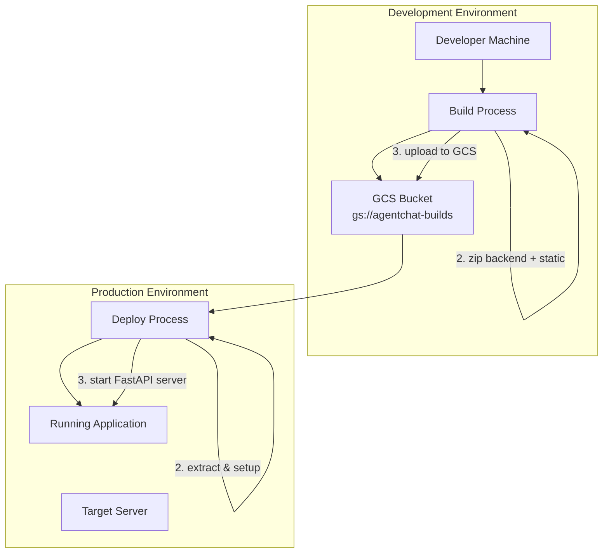

# Deployment Guide

This guide covers deploying AgentChat to production environments, including air-gapped systems.

## Deployment Overview

AgentChat uses a **modular monolith** deployment strategy where:
- Frontend is pre-rendered into static files
- Backend serves both API endpoints and static frontend
- Single deployable unit for simplified operations
- GCS-based artifact transfer for air-gapped environments

## Deployment Architecture



## Prerequisites

### Development Machine
- **Google Cloud CLI** configured
- **Access to GCS bucket** `gs://agentchat-builds`
- **Build dependencies**: Node.js, Python, uv

### Target Server
- **Python 3.13+**
- **Google Cloud CLI** (for GCS access)
- **Screen** (for background process management)
- **Network access** to GCS (or pre-downloaded artifacts)

## Automated Deployment

### 1. Build and Upload

From your development machine:

```bash
# Navigate to project root
cd agentchat

# Run automated build script
source scripts/build.sh
```

This script performs:
1. 🎨 **Frontend Build**: Installs dependencies and builds static files
2. 📦 **Archive Creation**: Creates timestamped zip of backend + static frontend
3. 🧹 **GCS Cleanup**: Removes old build archives
4. ☁️ **Upload**: Uploads new build to `gs://agentchat-builds/`
5. 🗑️ **Cleanup**: Removes local build artifacts

### 2. Deploy to Server

On your target server:

```bash
# Navigate to deployment location
cd /path/to/your/project

# Run automated deployment script
source scripts/deploy-vm.sh
```

This script performs:
1. 📁 **Setup**: Creates deployment directory at `$PROJECT_ROOT/test_serving`
2. 🔍 **Discovery**: Finds latest build archive in GCS bucket
3. ⬇️ **Download**: Downloads and extracts build archive
4. 🐍 **Environment**: Sets up Python virtual environment
5. 🛑 **Cleanup**: Kills existing server processes
6. 📺 **Start**: Launches FastAPI server in detached screen session
7. 📊 **Summary**: Provides deployment status and management commands

## Manual Deployment

### Frontend Build

```bash
cd services/frontend

# Install dependencies (if needed)
npm install

# Build static frontend
npm run build-static
```

This creates static files in `services/backend/build/static_frontend/`

### Backend Deployment

```bash
cd services/backend

# Create virtual environment
python -m venv .venv
source .venv/bin/activate  # On Windows: .venv\Scripts\activate

# Install dependencies
pip install -r requirements.txt
# OR using uv
uv sync

# Configure environment
cp .env.example .env
# Edit .env with production values

# Start server
uvicorn src.app.main:app --host 0.0.0.0 --port 8000 --workers 4
```

## Environment Configuration

### Production Environment Variables

Create `.env` file in backend directory:

```bash
# Google Cloud Configuration
GOOGLE_CLOUD_PROJECT=your-production-project
GOOGLE_CLOUD_LOCATION=us-central1
GOOGLE_GENAI_USE_VERTEXAI=TRUE

# Authentication
AUTH_SECRET=your-production-secret-key

# Application Configuration
FRONTEND_URL=https://your-domain.com
LOG_LEVEL=INFO

# Optional: Custom Search
GOOGLE_CSE_ID=your-cse-id
CUSTOM_SEARCH_API_KEY=your-api-key

# Production Settings
WORKERS=4
```

### Google Cloud Authentication

#### Option 1: Service Account (Recommended)

```bash
# Create service account
gcloud iam service-accounts create agentchat-prod \
    --display-name="AgentChat Production"

# Grant necessary permissions
gcloud projects add-iam-policy-binding your-project-id \
    --member="serviceAccount:agentchat-prod@your-project-id.iam.gserviceaccount.com" \
    --role="roles/aiplatform.user"

# Create and download key
gcloud iam service-accounts keys create agentchat-key.json \
    --iam-account=agentchat-prod@your-project-id.iam.gserviceaccount.com

# Set environment variable
export GOOGLE_APPLICATION_CREDENTIALS=/path/to/agentchat-key.json
```

#### Option 2: Application Default Credentials

```bash
gcloud auth application-default login
```

## Server Management

### Using Screen Sessions

The deployment script creates a detached screen session named `backend`:

```bash
# Attach to the running server (see logs in real-time)
screen -r backend

# Detach from screen session (server keeps running)
# Press: Ctrl+A, then D

# List all screen sessions
screen -list

# Kill the server session
screen -S backend -X quit
```

### Manual Server Management

```bash
# Find process using port 8000
lsof -ti:8000

# Kill process
kill -9 $(lsof -ti:8000)

# Start server manually
cd /path/to/deployment/test_serving
source .venv/bin/activate
uvicorn src.app.main:app --host 0.0.0.0 --port 8000 --workers 4

# Start in background
nohup uvicorn src.app.main:app --host 0.0.0.0 --port 8000 --workers 4 > server.log 2>&1 &
```

### Logs and Monitoring

```bash
# View deployment logs
tail -f /path/to/project/logs/deploy_YYYYMMDD_HHMMSS.log

# View application logs (if using screen)
screen -r backend

# View application logs (if using nohup)
tail -f server.log

# Check server status
curl -I http://localhost:8000/docs
```

## Production Optimizations

### Performance Settings

```bash
# Increase worker processes
uvicorn src.app.main:app --host 0.0.0.0 --port 8000 --workers 4

# Use production ASGI server
gunicorn src.app.main:app -w 4 -k uvicorn.workers.UvicornWorker --bind 0.0.0.0:8000
```

### Security Considerations

1. **HTTPS Configuration**
   ```bash
   # Use reverse proxy (nginx/Apache)
   # Or configure TLS directly
   uvicorn src.app.main:app --host 0.0.0.0 --port 8000 --ssl-keyfile=key.pem --ssl-certfile=cert.pem
   ```

2. **Firewall Configuration**
   ```bash
   # Allow only necessary ports
   ufw allow 8000/tcp
   ufw allow 22/tcp
   ufw enable
   ```

3. **Environment Security**
   ```bash
   # Secure .env file
   chmod 600 .env
   chown app:app .env
   ```

### Resource Limits

```bash
# Set memory limits
ulimit -m 2097152  # 2GB

# Monitor resource usage
htop
```

## Monitoring and Health Checks

### Health Check Endpoint

```bash
# Check application health
curl http://localhost:8000/health

# Check API documentation
curl http://localhost:8000/docs
```

### Log Aggregation

```bash
# Centralized logging setup
# Configure logrotate
sudo nano /etc/logrotate.d/agentchat

# Example logrotate configuration
/path/to/agentchat/logs/*.log {
    daily
    missingok
    rotate 30
    compress
    delaycompress
    notifempty
    create 644 app app
}
```

## Backup and Recovery

### Database Backup (if applicable)

```bash
# Backup session data
cp -r session_data/ backup/session_data_$(date +%Y%m%d_%H%M%S)/
```

### Configuration Backup

```bash
# Backup configuration
tar -czf config_backup_$(date +%Y%m%d_%H%M%S).tar.gz .env
```

## Rollback Procedures

### Quick Rollback

```bash
# List available builds
gsutil ls gs://agentchat-builds/

# Download specific version
gsutil cp gs://agentchat-builds/build-YYYYMMDD_HHMMSS.zip ./

# Deploy specific version
unzip build-YYYYMMDD_HHMMSS.zip
# Follow deployment steps
```

## Troubleshooting

### Common Issues

1. **Port Already in Use**
   ```bash
   lsof -ti:8000 | xargs kill -9
   ```

2. **Permission Errors**
   ```bash
   # Fix file permissions
   chmod +x scripts/*.sh
   chown -R app:app /path/to/deployment/
   ```

3. **Google Cloud Authentication**
   ```bash
   # Verify authentication
   gcloud auth list
   gcloud config get-value project
   ```

4. **Out of Memory**
   ```bash
   # Check memory usage
   free -h
   # Reduce worker count or increase server memory
   ```

### Debug Mode

Enable debug logging for troubleshooting:

```bash
# In .env file
LOG_LEVEL=DEBUG

# Restart application to apply changes
```

## Scaling Considerations

### Horizontal Scaling

```bash
# Multiple server instances
# Use load balancer (nginx, haproxy)
# Configure session affinity or shared session storage
```

### Vertical Scaling

```bash
# Increase worker processes
uvicorn src.app.main:app --workers 8

# Increase memory limits
export PYTHONHASHSEED=0
ulimit -m 4194304  # 4GB
```

## Maintenance

### Regular Maintenance Tasks

1. **Log Rotation**
   ```bash
   logrotate /etc/logrotate.d/agentchat
   ```

2. **Dependency Updates**
   ```bash
   uv sync --upgrade
   ```

3. **Security Updates**
   ```bash
   apt update && apt upgrade -y
   ```

4. **Build Cleanup**
   ```bash
   # Remove old builds from GCS (keep last 10)
   gsutil ls -l gs://agentchat-builds/ | sort -k2 | head -n -10 | awk '{print $3}' | xargs -I {} gsutil rm {}
   ```

This deployment guide ensures reliable, secure, and maintainable production deployments of AgentChat.
