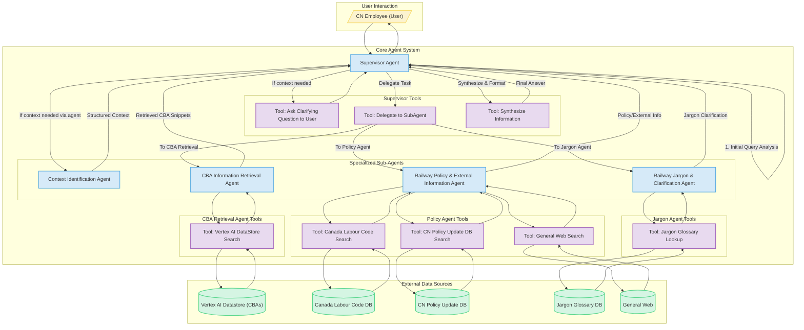

# Agent Orchestration


Backend service that coordinates AI agents for the Tariff Agent system.

## System Architecture

The following diagram illustrates the high-level architecture of the agent orchestration system:



The diagram shows the interaction between different components of the system:
- User Interaction: How CN employees interact with the system
- Core Agent System: The Supervisor Agent and specialized sub-agents
- Tools: Various capabilities available to each agent
- External Data Sources: The different data sources the system can query

## Development Setup

### Prerequisites

- Python 3.13+
- uv package manager
- Google Cloud CLI
- Access to GCP project with enabled APIs:
  - Vertex AI
  - BigQuery
  - Cloud Storage

### Environment Setup

```bash
# Install uv if not already installed
pip install uv

# Create virtual environment and install dependencies
uv venv
source .venv/bin/activate  # or `.venv\Scripts\activate` on Windows
uv pip install -r requirements.txt
```

### Configuration

```bash
# Set up Google Cloud authentication
gcloud auth application-default login
export GOOGLE_CLOUD_PROJECT="your-project-id"
```

## API Documentation

The API follows a versioned structure to ensure backward compatibility and easy evolution of the service.

### Base URLs

- Local Development: `http://localhost:8000`
- Documentation: 
  - Swagger UI: `/docs`
  - ReDoc: `/redoc`
  - OpenAPI JSON: `/openapi.json`

### API Versioning

All API endpoints (except documentation) are versioned using the format: `/api/v{version_number}/`

Current version: `v1`

### Endpoints

#### Root Endpoint

```
GET /

Returns basic API information including:
- API title
- Description
- Version
- Status
- Documentation URLs
```

#### Root Agent Endpoint

```
POST /api/v1/root_agent/

Process queries through the root agent.

Request Body:
{
    "text": string  // The query text (required, non-empty)
}

Response:
{
    "response": string  // The agent's response
}

Example:
curl -X POST http://localhost:8000/api/v1/root_agent/ \
  -H "Content-Type: application/json" \
  -d '{"text": "What are the latest tariff changes between US and China?"}'
```

### Error Handling

The API uses standard HTTP status codes:
- 200: Success
- 404: Not Found
- 422: Validation Error
- 500: Internal Server Error

## Running the Service

```bash
# Start the development server
uv run src/app.py
```

## Testing

### Running Tests

```bash
# Run all tests
pytest

# Run tests with coverage report
pytest  # Coverage is enabled by default

# Run specific test file
pytest tests/test_root_agent.py
```

### Test Coverage Requirements

The project requires a minimum test coverage of 80%. Current coverage areas:

1. **Well-Covered (>80%)**
   - Base agent functionality
   - Current impact agent core
   - Latest news agent
   - API endpoint structure

2. **Needs Improvement**
   - Prompt templates and configurations
   - Agent tools and utilities
   - Application lifecycle management
   - Error handling paths

To improve coverage:
1. Add test cases for error scenarios
2. Test configuration variations
3. Mock external dependencies
4. Add integration tests for agent tools
5. Test concurrent and edge cases

### Test Structure

```
tests/
├── conftest.py         # Test configuration and fixtures
├── test_root_agent.py  # Root agent endpoint tests
└── ...
```

### Test Categories

1. **Endpoint Structure Tests**
   - Validate API versioning
   - Check endpoint availability
   - Verify response formats

2. **Input Validation Tests**
   - Empty queries
   - Invalid payloads
   - Special characters

3. **Integration Tests**
   - Full request-response cycle
   - Agent interaction
   - Error handling

4. **Concurrent Request Tests**
   - Multiple simultaneous requests
   - Session management
   - Resource handling

### Coverage Configuration

Coverage settings are defined in `pyproject.toml`:
- Minimum coverage: 80%
- Branch coverage enabled
- Excludes initialization files
- Reports missing lines
- Ignores common boilerplate

## Project Structure

```
agent-orchestration/
├── src/
│   ├── agents/        # Agent implementations
│   ├── models/        # Data models
│   └── utils/         # Utility functions
├── tests/            # Test suite
├── pyproject.toml    # Project configuration
└── uv.lock          # Dependency lock file
```

