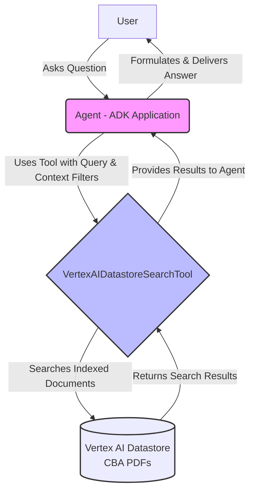

# Agent Orchestration


Backend service that coordinates AI agents for the Tariff Agent system.

## System Architecture

The following diagram illustrates the high-level architecture of the agent orchestration system:



The diagram shows the interaction between different components of the system:

- User Interaction: How CN employees interact with the system
- Core Agent System: The Supervisor Agent and specialized sub-agents
- Tools: Various capabilities available to each agent
- External Data Sources: The different data sources the system can query

## Development Setup

### Prerequisites

- Python 3.13+
- uv package manager
- Google Cloud CLI
- Access to GCP project with enabled APIs:
  - Vertex AI
  - BigQuery
  - Cloud Storage

### Environment Setup

```bash
# Install uv if not already installed
pip install uv

# Create virtual environment and install dependencies
uv venv
uv sync
```

### Configuration

1. Set up Google Cloud authentication:

```bash
gcloud auth application-default login
```

2. Configure environment variables:

```bash
# Copy the example environment file
cp .env.example .env

# Open the .env file and update the following variables:
# - GOOGLE_CLOUD_PROJECT: Your GCP project ID
# - GOOGLE_CLOUD_LOCATION: Your GCP region (e.g., us-central1)
# - FRONTEND_URL: Your frontend URL (default: http://localhost:3000)
# - GOOGLE_CSE_ID: Your Google Custom Search Engine ID (if using)
# - CUSTOM_SEARCH_API_KEY: Your Custom Search API key (if using)
```

For the Vertex AI configuration, ensure `GOOGLE_GENAI_USE_VERTEXAI=TRUE` is set in your `.env` file to use Vertex AI API through your GCP project.

If you prefer to use the Google AI Studio API directly, set `GOOGLE_GENAI_USE_VERTEXAI=FALSE` and provide your `GOOGLE_API_KEY`.

### Running the Server

Start the development server:

```bash
uvicorn src.app.main:app --reload --host 0.0.0.0 --port 8000
```

The server will be available at `http://localhost:8000`. The `--reload` flag enables auto-reloading when code changes are detected during development.
