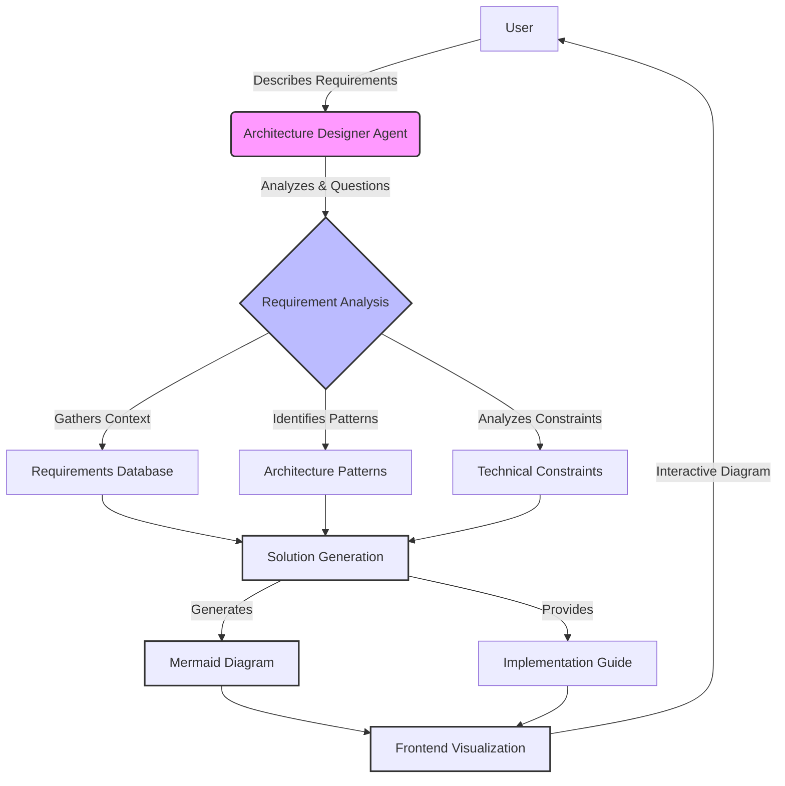
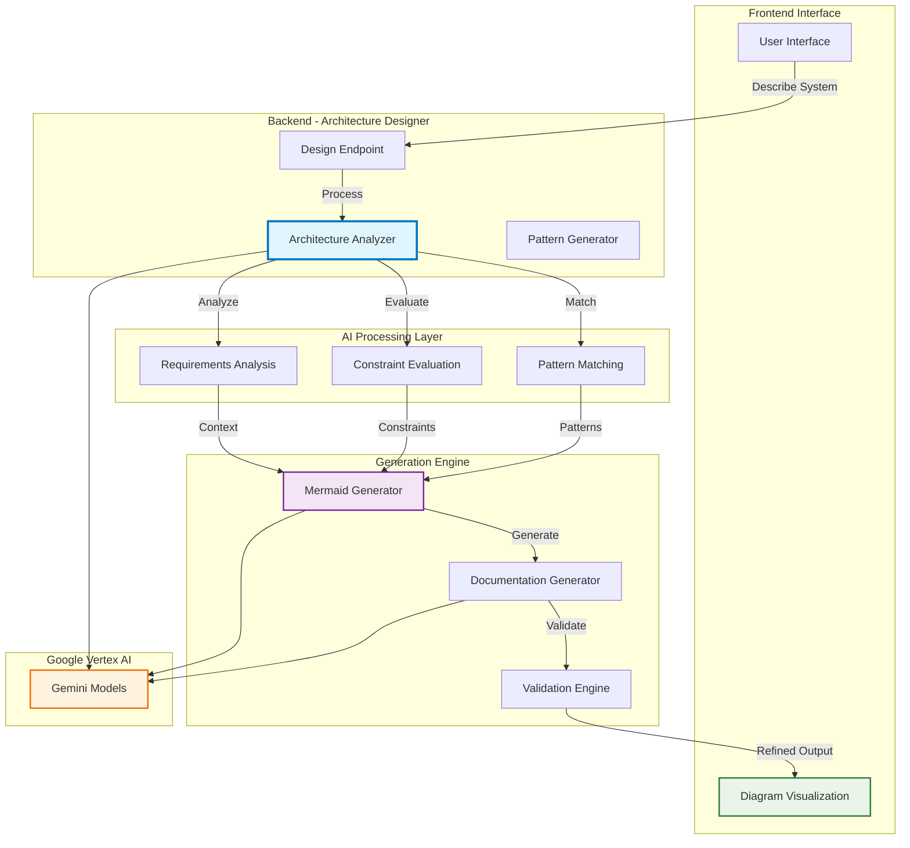

# Architecture Designer API


Backend service that provides AI-powered architecture design assistance, generating comprehensive system diagrams and technical documentation.

## System Architecture

### High-Level Architecture

The following diagram illustrates the high-level architecture of the architecture design system:



### Architecture Design Workflow

The Architecture Designer provides intelligent assistance throughout the design process, leveraging AI to understand requirements and generate comprehensive solutions.

#### How It Works

Our system guides users through a structured architecture design process:



#### Key Architecture Components

1. **Architecture Analyzer**

   ```python
   def analyze_requirements(self, description: str) -> ArchitectureAnalysis:
       # Processes user requirements and identifies key patterns
   ```

2. **Mermaid Generator**

   ```python
   def generate_diagram(self, analysis: ArchitectureAnalysis) -> str:
       # Creates comprehensive Mermaid diagrams based on analysis
   ```

3. **Pattern Matching Engine**
   - **Common Patterns**: Identifies microservices, monolithic, serverless patterns
   - **Best Practices**: Applies industry standards and architectural principles
   - **Constraint Optimization**: Balances requirements with technical constraints

#### Benefits

✅ **Comprehensive Analysis**: Deep understanding of requirements and constraints  
✅ **Pattern Recognition**: Automatic identification of appropriate architectural patterns  
✅ **Visual Diagrams**: Beautiful, interactive Mermaid diagrams  
✅ **Implementation Guidance**: Step-by-step recommendations for development

The diagram shows the interaction between different components of the system:

- User Requirements: How users describe their system needs
- AI Analysis: Intelligent processing and pattern recognition
- Diagram Generation: Creation of comprehensive Mermaid visualizations
- Interactive Feedback: Real-time refinement and optimization

## Development Setup

### Prerequisites

- Python 3.13+
- uv package manager
- Google Cloud CLI
- Access to GCP project with enabled APIs:
  - Vertex AI
  - BigQuery
  - Cloud Storage

### Environment Setup

```bash
# Install uv if not already installed
pip install uv

# Create virtual environment and install dependencies
uv venv
uv sync
```

### Configuration

1. Set up Google Cloud authentication:

```bash
gcloud auth application-default login
```

2. Configure environment variables:

```bash
# Copy the example environment file
cp .env.example .env

# Open the .env file and update the following variables:
# - GOOGLE_CLOUD_PROJECT: Your GCP project ID
# - GOOGLE_CLOUD_LOCATION: Your GCP region (e.g., us-central1)
# - FRONTEND_URL: Your frontend URL (default: http://localhost:3000)
# - GOOGLE_CSE_ID: Your Google Custom Search Engine ID (if using)
# - CUSTOM_SEARCH_API_KEY: Your Custom Search API key (if using)
```

For the Vertex AI configuration, ensure `GOOGLE_GENAI_USE_VERTEXAI=TRUE` is set in your `.env` file to use Vertex AI API through your GCP project.

If you prefer to use the Google AI Studio API directly, set `GOOGLE_GENAI_USE_VERTEXAI=FALSE` and provide your `GOOGLE_API_KEY`.

### Running the Server

Start the development server:

```bash
make dev
```

The server will be available at `http://localhost:8000`. The development mode enables auto-reloading when code changes are detected during development.

### Testing

The project includes comprehensive tests for file upload functionality and core components. All tests are located in the `tests/` directory.

#### Running Tests

Run all tests using pytest:

```bash
# Run all tests
pytest

# Run with verbose output
pytest -v

# Run specific test file
pytest tests/test_implementation.py

# Run tests with coverage report
pytest --cov=src --cov-report=term-missing
```

#### Test Structure

- `tests/test_implementation.py` - Integration tests for file processors and validators
- Test configuration is managed in `pyproject.toml`
- Coverage target is set to 65% (configurable in pyproject.toml)

#### Test Coverage

The tests cover:

- ✅ File processors (text, JSON, images, PDFs, code)
- ✅ File validators (MIME type detection, size limits, security)
- ✅ Component integration and error handling

For development, you can also run the implementation test directly:

```bash
python tests/test_implementation.py
```
