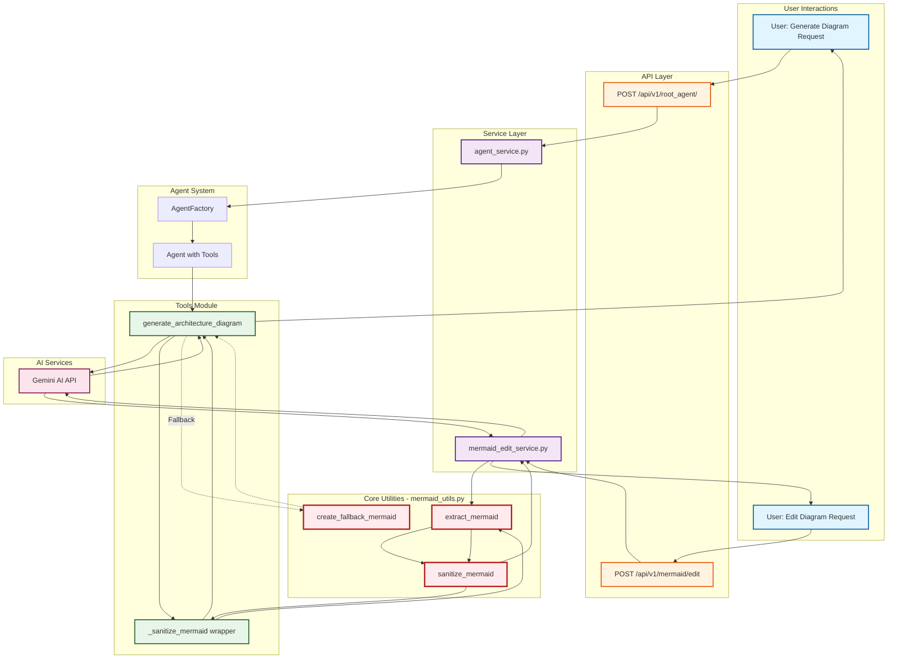

# Mermaid Utils Usage Flow Diagram



## Key Points

### ✅ mermaid_utils.py IS ACTIVELY USED

**Primary Usage Points:**

1. **src/agents/tools.py** (Line 151)
   - Every AI-generated diagram passes through `sanitize_mermaid()`
   - Called after Gemini generates the diagram code
2. **src/app/services/mermaid_edit_service.py** (Line 149)
   - Every edited diagram passes through `sanitize_mermaid()`
   - Called after Gemini edits the diagram code

### 📊 Usage Statistics

- **2 Production Call Sites** (agent tools + edit service)
- **4 Test Cases** (comprehensive test coverage)
- **100% of AI-generated diagrams** are sanitized
- **100% of edited diagrams** are sanitized

### 🎯 Critical for

- Preventing Mermaid parse errors
- Handling multiline labels in node definitions
- Normalizing Unicode and whitespace
- Ensuring consistent diagram rendering

### 🔄 Recent Enhancement (Oct 5, 2025)

Fixed multiline label issues that were causing parse errors like:

```
Parse error: Expecting 'SQE', 'DOUBLECIRCLEEND', got 'PS'
```

Now all multiline labels are properly collapsed to single lines.

### 📁 Documentation Created

See `docs/MERMAID_UTILS_USAGE.md` for complete usage documentation.
