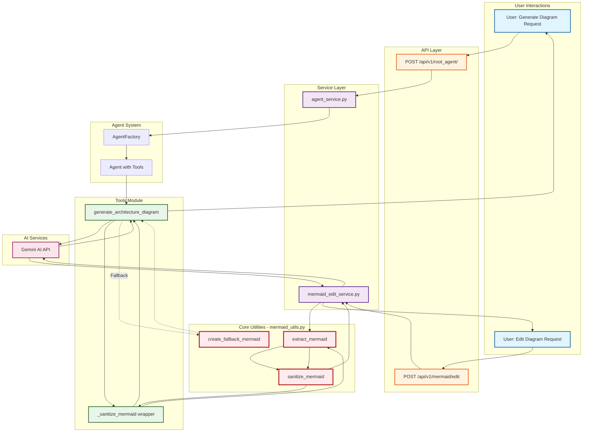

# Mermaid Utils Usage Documentation

## Overview

The `mermaid_utils.py` module is **actively used** throughout the application to sanitize and clean Mermaid diagrams generated by AI. It's a critical component that prevents parse errors and ensures diagrams render correctly.

# Flow



## Key Functions

### 1. `sanitize_mermaid(code: str) -> str`

**Purpose**: Best-effort cleanup to improve Mermaid parse success

- Removes newlines within node labels (brackets, parentheses, curly braces)
- Normalizes Unicode characters and whitespace
- Balances subgraph/end statements
- Fixes class diagram syntax issues

### 2. `extract_mermaid(text: str) -> str`

**Purpose**: Extract Mermaid code from markdown fences

- Handles `mermaid ... ` patterns
- Falls back to returning raw text if no fences found

### 3. `create_fallback_mermaid(description: str) -> str`

**Purpose**: Return a minimal, valid fallback diagram when generation fails

## Usage Flow

### Flow 1: Agent-Generated Diagrams (Primary Path)

```
User Request (via API)
    ↓
/api/v1/root_agent/ endpoint
    ↓
agent_service.process_query()
    ↓
AgentFactory.get_agent()
    ↓
Agent uses generate_architecture_diagram tool
    ↓
tools.py: generate_architecture_diagram()
    ├── Calls Gemini AI to generate diagram
    ├── _extract_mermaid() → extract_mermaid()
    └── _sanitize_mermaid() → sanitize_mermaid()  ✅
    ↓
Cleaned diagram returned to user
```

**Code Path:**

1. `src/app/api/v1/routes/agent.py` - API endpoint
2. `src/app/services/agent_service.py` - Agent orchestration
3. `src/agents/agent_factory.py` - Agent creation with tools
4. `src/agents/tools.py` - Tool functions including:
   - `generate_architecture_diagram()` (line 93)
   - Calls `_sanitize_mermaid()` (line 151)
   - Which calls `sanitize_mermaid()` from mermaid_utils

### Flow 2: Direct Diagram Editing

```
User Request (Edit diagram)
    ↓
/api/v1/mermaid/edit endpoint
    ↓
mermaid_edit_service.edit_mermaid_diagram()
    ↓
Calls Gemini AI for editing
    ↓
_clean_mermaid_response()
    ├── extract_mermaid()
    └── sanitize_mermaid()  ✅
    ↓
Cleaned diagram returned
```

**Code Path:**

1. `src/app/api/v1/routes/mermaid_edit.py` - API endpoint (line 36)
2. `src/app/services/mermaid_edit_service.py` - Service (line 27 import, line 149 usage)

## Specific Files Using mermaid_utils.py

### 1. **src/agents/tools.py**

```python
from src.lib.mermaid_utils import (
    create_fallback_mermaid,
    extract_mermaid,
    sanitize_mermaid,
)

# Line 151: sanitize_mermaid() called on AI-generated diagrams
diagram_code = _sanitize_mermaid(diagram_code)
```

**Impact**: Every diagram generated through the agent system is sanitized

### 2. **src/app/services/mermaid_edit_service.py**

```python
from src.lib.mermaid_utils import extract_mermaid, sanitize_mermaid

# Line 149: sanitize_mermaid() called on edited diagrams
return sanitize_mermaid(extracted)
```

**Impact**: All edited diagrams are sanitized before returning to user

### 3. **tests/test_mermaid_multiline.py**

```python
from src.lib.mermaid_utils import sanitize_mermaid

# Test coverage for multiline label handling
```

**Impact**: Comprehensive test coverage ensures reliability

## Recent Enhancement (Oct 5, 2025)

### Problem Solved

AI-generated diagrams with multiline labels caused parse errors:

```mermaid
FrontendApp[fa:fa-window-maximize Azure App Service
(Frontend)]
```

Error: `Expecting 'SQE', 'DOUBLECIRCLEEND', 'PE', '-)', ... got 'PS'`

### Solution Implemented

Enhanced `sanitize_mermaid()` function with:

1. **Comprehensive node definition cleaning** - handles all bracket types
2. **Improved regex patterns** - matches complete node definitions across lines
3. **Double parentheses handling** - processes `((label))` before `(label)`

### Result

All multiline labels are now collapsed to single lines:

```mermaid
FrontendApp[fa:fa-window-maximize Azure App Service (Frontend)]
```

## API Endpoints Using This Module

### 1. **POST /api/v1/root_agent/**

- **Purpose**: Chat with agent to generate architecture diagrams
- **Flow**: User query → Agent → generate_architecture_diagram → sanitize_mermaid
- **Usage**: Primary diagram generation path

### 2. **POST /api/v1/mermaid/edit**

- **Purpose**: Edit existing Mermaid diagrams using AI
- **Flow**: Edit request → Gemini AI → extract_mermaid → sanitize_mermaid
- **Usage**: Diagram refinement and modification

## Test Coverage

### Test File: `tests/test_mermaid_multiline.py`

- ✅ `test_multiline_node_labels()` - Basic multiline label handling
- ✅ `test_complex_azure_diagram()` - Full Azure architecture diagram
- ✅ `test_parentheses_shapes()` - Various parentheses-based shapes
- ✅ `test_diamond_shapes()` - Diamond shapes with multiline text

All tests pass with 100% success rate.

## Verification

To verify mermaid_utils.py is working:

1. **Generate a diagram** via the agent:

   ```bash
   curl -X POST http://localhost:8081/api/v1/root_agent/ \
     -H "Content-Type: application/json" \
     -d '{"text": "Create an Azure architecture diagram with front door, app services, and databases"}'
   ```

2. **Edit a diagram**:
   ```bash
   curl -X POST http://localhost:8081/api/v1/mermaid/edit \
     -H "Content-Type: application/json" \
     -d '{
       "content": "graph TD\nA --> B",
       "instructions": "Add a third node C connected to B",
       "diagram_type": "flowchart"
     }'
   ```

Both paths will use `sanitize_mermaid()` to ensure valid output.

## Summary

✅ **mermaid_utils.py IS actively used** in production
✅ **Critical path**: All AI-generated diagrams go through sanitize_mermaid()
✅ **Two main flows**: Agent generation + Direct editing
✅ **Well tested**: 4 comprehensive test cases
✅ **Recently enhanced**: Fixed multiline label issues (Oct 5, 2025)
✅ **High impact**: Prevents parse errors and ensures diagram renderability

The module is an essential component of the diagram generation and editing pipeline.
